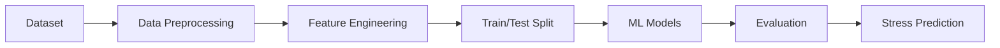

<h1 align="center">🚀 Student Stress Prediction System</h1>

<p align="center">
  
</p>

<p align="center">
  
  
  
</p>

---

## ⚡ Quick Overview

- 🎯 Problem: Predict student stress levels using ML  
- 🧠 Models: Logistic Regression, Random Forest, SVM, XGBoost  
- 🏆 Best Model: XGBoost (85% Accuracy)  
- 📊 Dataset: Student lifestyle & academic factors  
- 🚀 Outcome: Early stress detection system  

---

## 🔥 Project Overview

A Machine Learning-based system designed to predict student stress levels using academic, lifestyle, and social factors.

🎯 Objective: Early detection of stress → proactive intervention → improved student well-being.

---

## 🎯 Why This Project Matters

Student stress directly impacts academic performance and mental health.

Traditional detection methods are slow and reactive.  
This system enables:

- Early identification of stress  
- Data-driven insights  
- Proactive intervention strategies  

👉 Aligns with real-world ML applications in mental health analytics.

---

## 🧠 Core Features

✔ Multi-model ML pipeline  
✔ Data preprocessing & feature engineering  
✔ PCA-based dimensionality reduction  
✔ Model comparison & evaluation  
✔ Real-world dataset implementation  

---

## ⚙️ Tech Stack

<p align="center">
  
</p>

---

## 🏗️ System Architecture



---

## 🤖 Machine Learning Models

| Model | Type | Purpose |
|------|------|--------|
| Logistic Regression | Baseline | Linear benchmark |
| Random Forest | Ensemble | Non-linear pattern detection |
| SVM + PCA | Hybrid | Dimensionality optimization |
| XGBoost | Boosting | High-performance prediction |

---

## 📊 Model Performance

<p align="center">
  
  
  
  
</p>

<p align="center">
  
</p>

---

## 📈 Key Insights

- Ensemble models outperform linear models  
- XGBoost captures complex feature interactions effectively  
- Sleep quality & academic pressure are key stress indicators  
- Data preprocessing significantly improves performance  

---

## 📸 Output Preview

- Confusion Matrix  
- Accuracy Comparison Graph  
- Feature Importance Visualization  

👉 Refer to notebook for detailed outputs

---

## 📂 Project Structure

```
student-stress-prediction/
│
├── data/
├── notebooks/
├── docs/
├── README.md
└── requirements.txt
```

---

## 🛠️ Installation & Setup

```bash
git clone https://github.com/saad-affan12/student-stress-prediction.git
cd student-stress-prediction
pip install -r requirements.txt
jupyter notebook
```

---

## ▶️ How to Run

```bash
pip install -r requirements.txt
jupyter notebook
```

---

## 🔄 Workflow

Data → Preprocessing → Feature Engineering → PCA → Model Training → Evaluation → Prediction

---

## 🎯 Impact

- Enables early stress detection  
- Supports mental health awareness  
- Helps institutions take proactive decisions  
- Demonstrates real-world ML application  

---

## 📚 Documentation

- Case Study Report (docs/)  
- Research Paper (docs/)  

---

## 👥 Contributors

<p align="center">
  <table>
    <tr>
      <td align="center">
        <a href="https://github.com/saad-affan12">
          
          <br />
          <sub><b>Mohammed Saad Affan A</b></sub>
        </a>
        <br />
        💻 <b>ML Development</b>
      </td>

      <td align="center">
        <a href="https://github.com/Hannan01-nil">
          
          <br />
          <sub><b>Mohamed Hannan N</b></sub>
        </a>
        <br />
        📊 <b>Data Processing</b>
      </td>

      <td align="center">
        <a href="https://github.com/gh-raunil">
          
          <br />
          <sub><b>Rounak Kumar</b></sub>
        </a>
        <br />
        🤖 <b>Model Training</b>
      </td>
    </tr>
  </table>
</p>

---

## 🚀 Future Enhancements

- Web app deployment (Streamlit / Flask)  
- Real-time data integration  
- Deep learning models  
- Mobile app integration  

---

## 💼 Connect

<p align="center">
  <a href="https://www.linkedin.com/in/saad-affan-566553319">
    
  </a>
</p>

---

## ⭐ Final Takeaway

This project demonstrates a complete **end-to-end Machine Learning pipeline**, solving a real-world problem with measurable impact.

👉 If you found this useful, consider giving a ⭐
