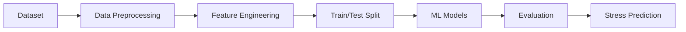

# 🚀 🧠 Student Stress Prediction System  
### Machine Learning | Data Science | Real-World Impact

<p align="center">
  
</p>

---

## 🔥 Project Overview
A Machine Learning-based system designed to predict student stress levels using academic, lifestyle, and social factors.

🎯 Objective: Early detection of stress → proactive intervention → improved student well-being.

---

## 🧠 Core Features
✔ Multi-model ML pipeline  
✔ Data preprocessing & feature engineering  
✔ PCA-based dimensionality reduction  
✔ Model comparison & evaluation  
✔ Real-world dataset implementation  

---

## ⚙️ Tech Stack

<p align="center">
  
</p>

---

## 🏗️ System Architecture



---

## 🤖 Machine Learning Models

| Model | Type | Purpose |
|------|------|--------|
| Logistic Regression | Baseline | Linear benchmark |
| Random Forest | Ensemble | Non-linear pattern detection |
| SVM + PCA | Hybrid | Dimensionality optimization |
| XGBoost | Boosting | High-performance prediction |

---

## 📊 Model Performance

<p align="center">
  
  
  
  
</p>

<p align="center">
  
</p>

---

## 📈 Key Insights
- Ensemble models outperform linear models  
- XGBoost captures complex feature interactions effectively  
- Sleep quality and academic pressure are major stress indicators  
- Data preprocessing significantly improves performance  

---

## 📂 Project Structure

```
student-stress-prediction/
│
├── data/
│   └── dataset.csv
│
├── notebooks/
│   └── Student_Stress_Prediction.ipynb
│
├── docs/
│   ├── case_study.docx
│   └── research_paper.pdf
│
├── README.md
└── requirements.txt
```

---

## 🛠️ Installation & Setup

```bash
git clone https://github.com/YOUR_USERNAME/student-stress-prediction.git
cd student-stress-prediction
pip install -r requirements.txt
jupyter notebook
```

---

## 🔄 Workflow

1. Data Collection  
2. Data Cleaning & Preprocessing  
3. Feature Engineering  
4. PCA (Dimensionality Reduction)  
5. Model Training  
6. Evaluation  
7. Prediction Output
   
---
## ▶️ How to Run

```bash
pip install -r requirements.txt
jupyter notebook
```

## 🎯 Impact
- Enables early stress detection  
- Supports mental health awareness  
- Helps institutions take proactive decisions  
- Demonstrates real-world ML application  

---

## 📚 Documentation
- Case Study Report (docs/)  
- Research Paper (docs/)  

---

## 👥 Team
- Mohammed Saad Affan A  
- Mohamed Hannan N  
- Rounak Kumar  

---

## 🚀 Future Enhancements
- Web app deployment (Streamlit / Flask)  
- Real-time data integration  
- Deep learning models  
- Mobile app integration  

---

## 💼 Connect

<p align="center">
  <a href="https://www.linkedin.com/in/saad-affan-566553319">
    
  </a>
</p>

---

## ⭐ Final Note
This project demonstrates a complete Machine Learning pipeline from data preprocessing to model deployment, solving a real-world problem in student mental health.
